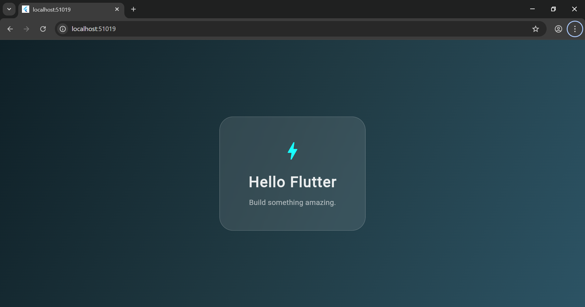

# Experiment 1:  Introduction to Flutter & Hello World
App

## Student Information
* **Name:** Kartik Swami
* **Roll Number:** 23EACCS147
* **Batch:** Gamma-1
* **Course:** Computer Science Engineering
* **Experiment Title:** Experiment-1

---

##  Aim
To study the **Flutter SDK**, configure the **Android Studio** setup, and create a basic "Hello World" Flutter application.

##  Procedure
Flutter is an open-source UI toolkit by Google used to build natively compiled applications for mobile, web, and desktop from a single codebase.

1.  **Environment Setup**: Downloaded and configured the Flutter SDK and added it to the system environment variables.
2.  **IDE Configuration**: Installed Android Studio and enabled the Flutter and Dart plugins.
3.  **Project Initialization**: Created a new Flutter project using `flutter create`.
4.  **Implementation**: Modified the `lib/main.dart` file to display a simple text widget.

###  Output
The application successfully compiles and runs on the emulator/device, displaying **'Hello Flutter'** at the center of the screen.
### Conclusion
By completing this experiment, I have successfully set up the Flutter development environment and understood the basic widget-based structure of a Flutter application.

